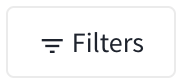
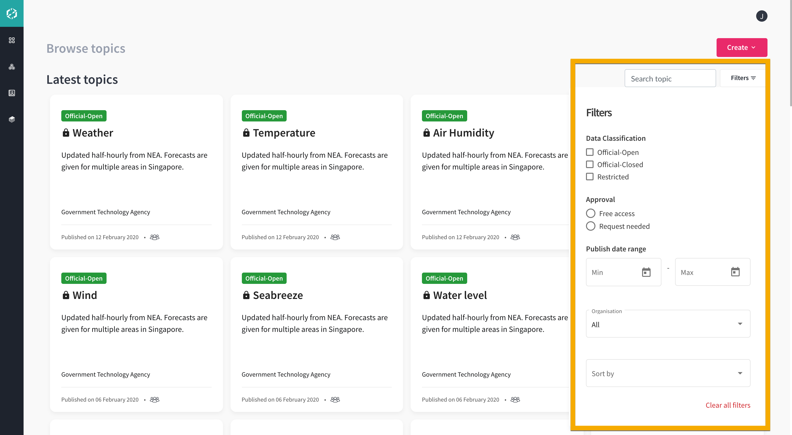
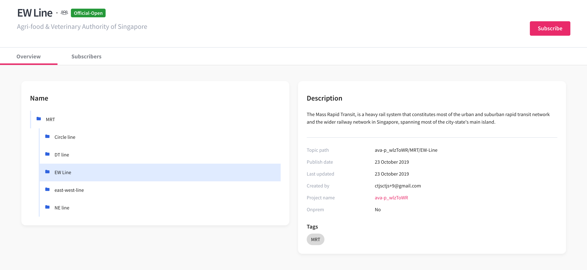

# Browse Topics

The **Browse Topics** page displays the latest topics and available topics in cards containing the topic related information. 

Each topic in the card is classified as:

- **Official-Open**  - Refers to unclassified information disclosed to the public in the normal course of duty

- **Official-Closed**  - Refers to unclassified information not disclosed to the public in the normal course of duty

- **Restricted**  - Refers to unauthorised disclosure could cause SOME DAMAGE to an Agency

Published date for each topic in the card is displayed. 

Hover to the icons shown for each topic in the card and a tooltip appears: 

-  icon – This icon displays “Approval is needed from publisher before you subscribe” 
- Visibility icon – This icon displays who can view the topic 
  -  All government agencies – This means all government agencies can view the topics
  -  Only my agency – This means only the members of my agency can view the topics 
  
   

You can search for topic by entering the topic name in the  input box. 

Click  to filter the following:

- **Data Classification** – Filter the topic classified as Official-Open, Official-Closed, and Restricted
- **Approval** – Filter the topic whether approval is needed from the publisher as Free access or Request needed
- **Publish date range** – Filter the topic based on selected range of publishing date
- **Organisation** – Select from the dropdown to filter the organisation 
- **Sort By** – Select from the dropdown to filter the newest, oldest, and recently updated topics

Click **Clear all filters** to clear all filters selected.

In the Browse Topics, you can start to create your own topic and project by clicking **Create** button. 

For related information about how to add more topics, see [Insert Reference - My Topics]. 
For related information about how to create project, see [Insert Reference - Projects].

## Topic Details

You can view each topic in the card to know the details and what the topic is all about. 

As a Publisher you can:

- See the topic overview
- See folders and its subfolders within the topic
- Edit folders and its subfolders within the topic
- See subscribers to the topic
- Edit own topic only
- Subscribe to the topic

As a Subscriber you can:

- See the topic overview
- See folders and its subfolders within the topic
- Subscribe to the topic

