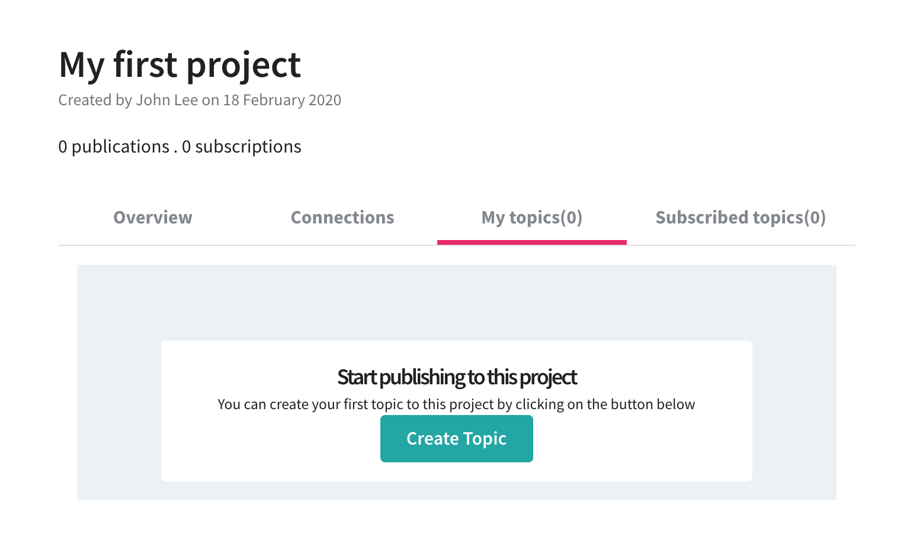
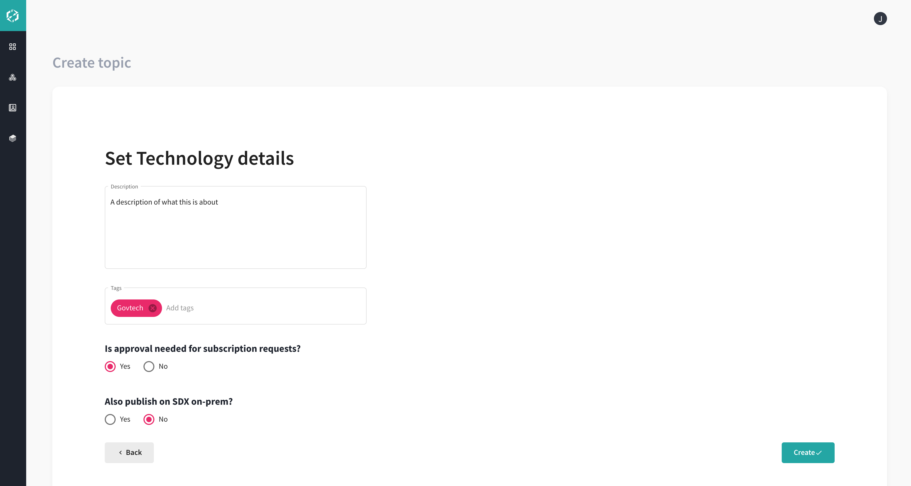
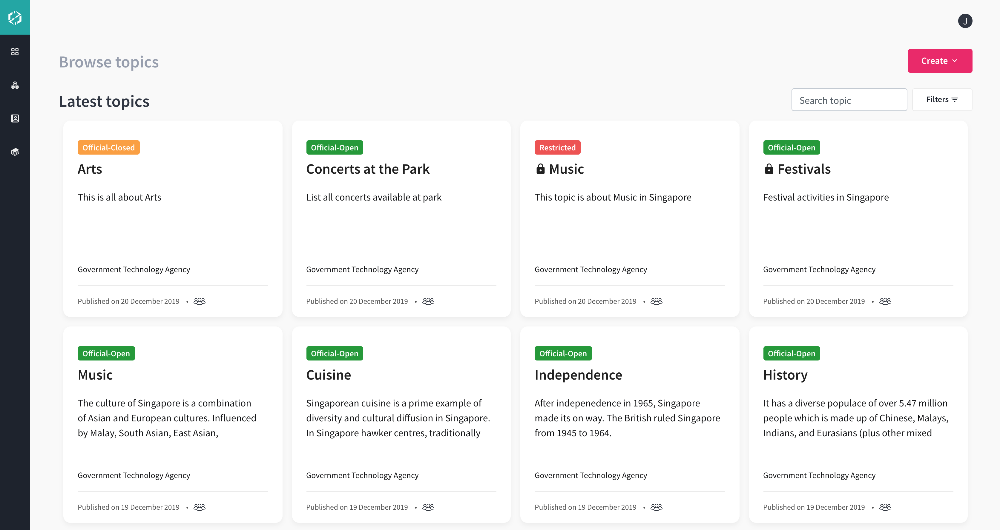
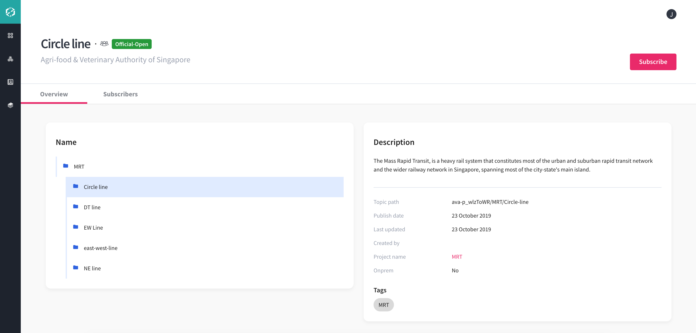
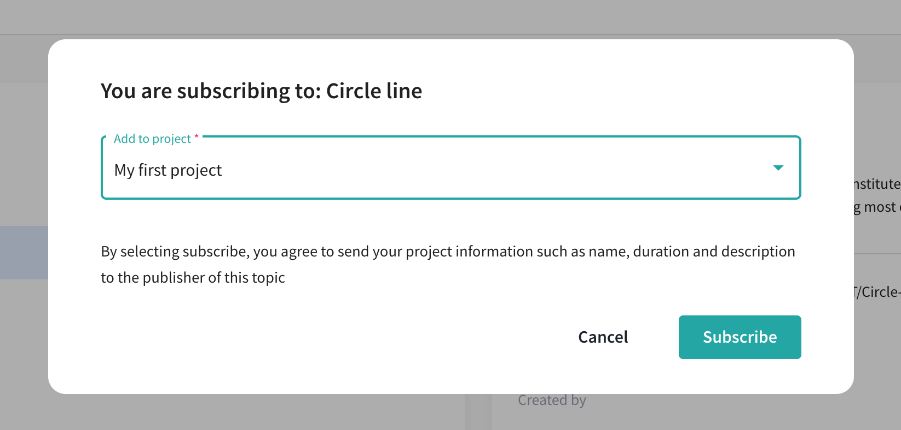
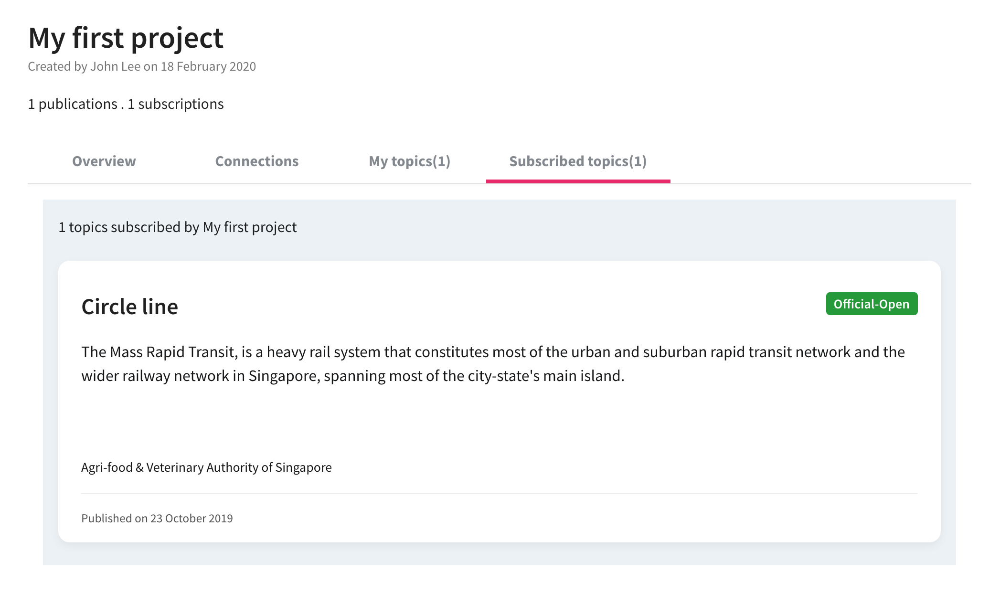

# Projects

A project is a piece of planned work or activity where you can organize and arrange topics that you intend to publish and wish to subscribe to.

It contains connection strings and SSL certifications to set up a connection to MQTT. MQTT stands for Message Queuing Telemetry Transport. It is a publish/subscribe protocol where you can publish and receive messages as a client, often called a “broker”. The job of an MQTT broker is to filter messages based on topic, and then distribute them to subscribers. There is no direct connection between a publisher and subscriber. All clients can publish (broadcast) and subscribe (receive).

To publish your relevant information, you must first create your own project to create a topic and subscribe to your own topic. A topic cannot be duplicated  and cannot published and subscribed to the same project again.

Both publisher and subscriber can create a project. Both publisher and subscriber need to have a project before both can publish or subscribe to any topic. Only the publisher can create a topic.

You can create new project by clicking [Insert icon] button on the top right of the Browse Topics page and select **New Project**.

Or, click [Insert icon] from the left side navigation bar.

## Create New Project ##

To create new project:

1.	Click [Insert icon]. The Projects page is displayed. 

    **Note:** *For your first project, you will see this page, see [Insert x-ref - Figure 32].*

[Insert screenshot - Create Project]

2.	Enter the following information.
  - Project Name
  - Project Duration
  - Description

The newly created project appears in the **Projects** page > **Overview** tab. Click [Insert icon].

In the Projects page, displays the project name, date created, number of publication and subscription. It also includes the following tabs:

- Overview – Displays the details of the project, see [Insert x-ref - Figure 34]
- Connections – Displays the details to set up and connect to MQTT Client.
- My topics – Displays the topic that you have published to this project and the total number of topics published by this project. 
  **Note:** *This tab is only available for a Publisher only.*
  
- Subscribed topics – Displays the topic that you have subscribed by this project and the total number of topics subscribed by this project.

[Insert How to create projects]

## Set up MQTT connections ##

After creating a new project, this tab shows the connection strings and SSL certificates to setup connections to MQTT. 

- Certificate chain
- Client certificate
- Private key 

  **Note:** *The Private key only appears once. You must copy and save the certificates in a text editor file.*
 
 Alternatively, click **Generate certificate** button.
 
  [Insert screenshot - SSL Certificates Information]
  
  You will receive a password through email and use that password in the Client key passphrase field.

To set up MQTT Client connection:

1.	Copy the certificates in a Text Editor and save each file separately.
2.	Now, open MQTT Client.

[Insert screenshot - MQTT Client]

3. Click Create MQTT Client.

A Publisher can create MQTT connection using the certificates generated and with the password from the email inbox.

4. Set up MQTT connections with the following:

- MQTT Client Name – Name is not specific and can give random name
- Protocol - Select protocol. For example, mqtt/tls
- Host - Enter host name. For example, sdx.sensors.gov.sg
- Upload each file you copied in a Text Editor in the following fields: 
  - CA file
  - Client certificate file
  - Client key file
- Enter the password received from the email inbox in the Client key passphrase field

[Insert Screenshot - MQTT Client Setting]

- Click [Insert icon] and connected successfully.

[Insert Screenshot - MQTT Client Connected]

5. Using MQTT client, a publisher published a topic.

- Copy the topic path and fill into the **Topic to publish** field in MQTT client. For example: govtech-ndmrcHUWg/Topic-temperature
- Click **Subscribe** button
- Subscriber is ready to receive data for this topic

[Insert screenshot - Subscriber received published data]

[Insert How to Set up Conncetions to MQTT video]

## My Topics ##

After creating a project, create your first topic. The **My Topics** tab is only available for a Publisher. This tab shows the topic that have been published on this project.

To create a topic:

1. Navigate to **Projects** page > **My topics** tab. Click [Insert icon].

2. Select from the option who can see the topic. Click [Insert icon].

- All government agencies
- Only my agency

3.	Select data classification. Click [Insert icon].

4.	Select the project and enter topic name. Click [Insert icon].

5.	Fill in the following details of the topic.

- Description – Enter description to the topic
- Tags – Add tags to the topic maximum of 5 tags
- Is approval needed for subscription requests?
  - Yes – Approval is needed from publisher before you subscribe 
  - No – Allows free access to the topic and no approval needed from the publisher
- Also publish on SDX on-prem?
  - Yes – Refer to the steps in [Insert x-ref- Publish Topic on SDX On-Premises] and continue 
  - No

6. Click [Insert icon]. The new topic is created successfully.

You can see the newly created topic being added in **Projects** page > **My topics** tab.

[Insert screenshot - Projects - My topics tab]

[Insert How to create topic]

### Publish Topic on SDX On-Premises ###

To publish topic on SDX on-premises:

1.	Click **Yes** in Also publish on SDX on-prem? field.
2.	Select the project code and name. 
3.	Click [Insert icon].

[Insert how to publish topic topic to SDX on-prem]

You can add more topics within the topic on your own project by selecting from topic folder or subfolder and clicking the   icon.

### Add Topic ###

To add new topic:

1.	Navigate to Projects and select topic folder or subfolder in **My topics** tab. 
2.	Click [Insert icon] and click **New Topic**. A new window appears to create new topic.

3.	Enter topic name and click [Insert icon].

The newly created topic is added successfully in the Topic Details page.

### Edit Topic ###

To edit topic:

1.	Navigate **Projects** > **My topics**. 
2.	Select a topic to edit and the Topic Details page displayed. 
3.	Click [Insert icon]. A new window appears to edit the details of the topic.

4. Click [Insert icon].

## Subscribed Topics ##

Both publisher and subscriber can subscribe to a topic. Both publisher and subscriber can view the Subscribed topics tab.

To subscribe to a topic:

1.	Navigate to **Projects** page > **Subscribed topics** tab. Click [Insert icon].

2.	Select the topic card that you want to subscribe.

3.	Once the topic card is selected, the Topic Details page is displayed. Click [Insert icon].

4.	Select a project to subscribe to the topic. Click [Insert icon].

5.	Go back to **Projects** and click **Subscribed topics** tab. The new subscription is added to the subscribed topics.

