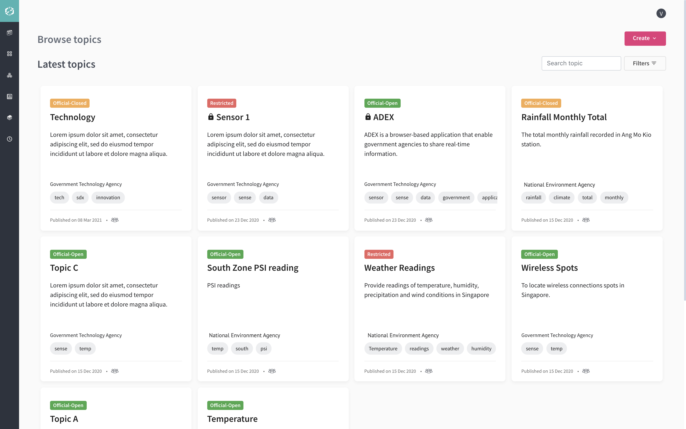
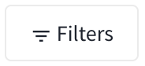

# Browse Topics

The **Browse Topics** page displays the latest topics and available topics in cards containing the topic related information. 

Each topic in the card is classified as:

-  - Refers to unclassified information disclosed to the public in the normal course of duty

-  - Refers to unclassified information not disclosed to the public in the normal course of duty

-  - Refers to unauthorised disclosure could cause SOME DAMAGE to an Agency

Published date for each topic in the card is displayed. 

Mouse hover over icons and a tooltip appears for each topic in the card: 

-  icon – This icon displays “Approval is needed from publisher before you subscribe” 

- Visibility icon – Displays who can view the topic: 
  -  – This icon displays "All government agencies can view topic"
  -  – This icon displays "Only members of my agency can view topic" 

  
   

You can search for topic by entering the topic name in the  input box. 

Click  to filter the following:

- **My Topics** - Filter your own creted topics
- **Data Classification** – Filter the topic classified as Official-Open, Official-Closed, and Restricted
- **Approval** – Filter the topic whether approval is needed from the publisher as Free access or Request needed
- **Publish date range** – Filter the topic based on selected range of publishing date
- **Organisation** – Select from the dropdown to filter the organisation 
- **Sort By** – Select from the dropdown to filter the newest, oldest, and recently updated topics

Click **Clear all filters** to clear all filters selected.

In the Browse Topics, you can start to create your own topic and project by clicking **Create** button. 

For related information about how to add more topics, see **My Topics**. 

For related information about how to create project, see **Projects**.

## Topic Details

You can view each topic in the card to know the details and what the topic is all about. 

As a Publisher you can:

- See the topic overview
- See folders and its subfolders within the topic
- Edit folders and its subfolders within the topic
- See subscribers to the topic
- Edit own topic only
- Subscribe to the topic
- See the status of the topic
- Delete own topic only

As a Subscriber you can:

- See the topic overview
- See folders and its subfolders within the topic
- Subscribe to the topic
- See the status of the topic

